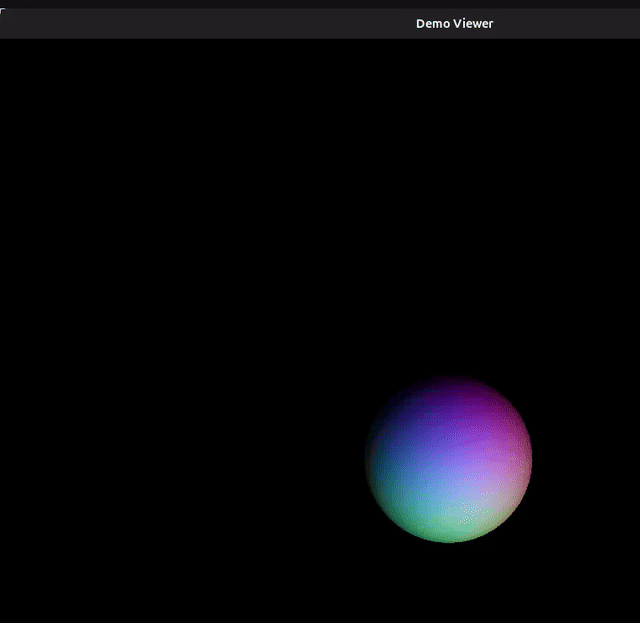
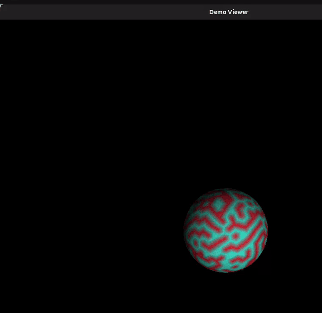

# Software 3D Renderer in Java

This project is a small software-rendering engine written in Java and displayed with Swing. It renders 3D triangles on the CPU without OpenGL or DirectX, using custom transforms, projection, shading, and depth testing.

## Screen Captures

The README previews below are converted from the recordings in [`ScreenCpatures`](./ScreenCpatures).

### Current demo view


### Additional renderer outputs captured during development




## What the Project Currently Shows

- A Swing window titled `Demo Viewer`
- A horizontal slider for heading rotation
- A vertical slider for pitch rotation
- A software-rendered coloured tetrahedron
- Black background render surface
- Continuous redraw when sliders move

## Renderer Features Present in the Codebase

- Custom 3x3 matrix-based rotation transforms in [`src/main/java/org/Aayush/Core/SliderUtil.java`](./src/main/java/org/Aayush/Core/SliderUtil.java)
- Perspective projection using a configurable camera distance in [`src/main/java/org/Aayush/Rasterization/Rasterizer.java`](./src/main/java/org/Aayush/Rasterization/Rasterizer.java)
- Triangle rasterization using barycentric coordinates
- Z-buffer depth testing for hidden-surface removal
- Per-pixel directional lighting with ambient light
- Interpolated normals for smooth shading across a triangle
- Vertex-position-based RGB colour generation
- Utility methods for vector normalization and cross products in [`src/main/java/org/Aayush/Rasterization/Shader.java`](./src/main/java/org/Aayush/Rasterization/Shader.java)
- A gamma-aware shading helper function (`getShade`) included in the shader utilities
- Procedural icosahedron generation in [`src/main/java/org/Aayush/Runner/MulticolourSphere.java`](./src/main/java/org/Aayush/Runner/MulticolourSphere.java)
- Repeated mesh inflation to approximate a smoother sphere
- Support for multiple inflation levels, including the commented `second level` and `third level` progression in the source
- A commented wireframe drawing path in [`src/main/java/org/Aayush/Runner/Drawer.java`](./src/main/java/org/Aayush/Runner/Drawer.java)
- A commented alternate draw path for rendering the generated sphere instead of the tetrahedron

## Project Structure

- [`src/main/java/org/Aayush/App.java`](./src/main/java/org/Aayush/App.java): entrypoint
- [`src/main/java/org/Aayush/Runner/DemoViewer.java`](./src/main/java/org/Aayush/Runner/DemoViewer.java): Swing UI and sliders
- [`src/main/java/org/Aayush/Runner/Drawer.java`](./src/main/java/org/Aayush/Runner/Drawer.java): scene draw loop
- [`src/main/java/org/Aayush/Runner/MulticolourSphere.java`](./src/main/java/org/Aayush/Runner/MulticolourSphere.java): procedural sphere generation
- [`src/main/java/org/Aayush/Core`](./src/main/java/org/Aayush/Core): matrix, vertex, and triangle primitives
- [`src/main/java/org/Aayush/Rasterization`](./src/main/java/org/Aayush/Rasterization): rasterizer and shader helpers

## Build and Run

### Requirements

- Java 8 or newer
- Maven

### Run the application

```bash
mvn compile
mvn exec:java -Dexec.mainClass=org.Aayush.App
```

### Run tests

```bash
mvn test
```

## Notes

- The default `App -> DemoViewer -> Drawer` path currently renders the tetrahedron scene.
- The sphere generation and alternate wireframe-related logic are present in the code and are reflected in the included development recordings.
