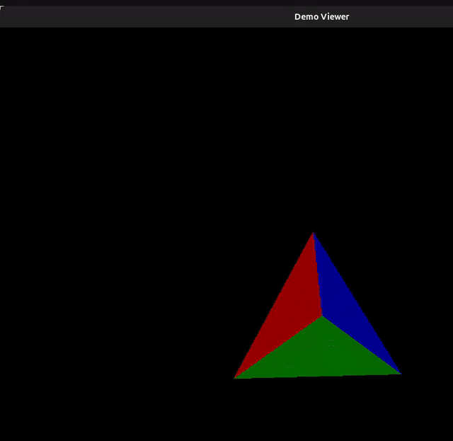
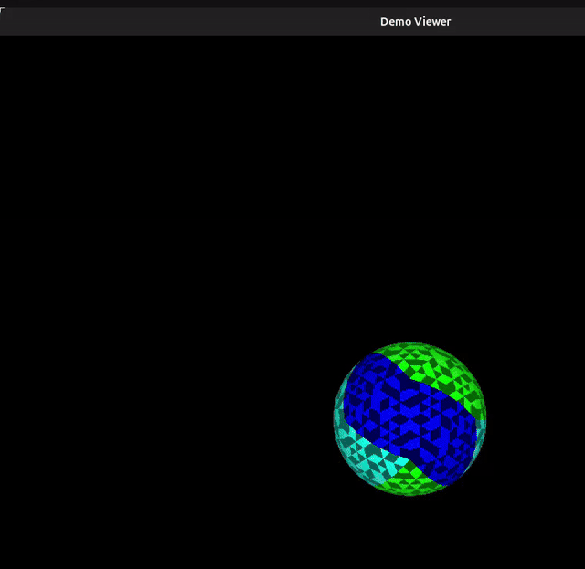
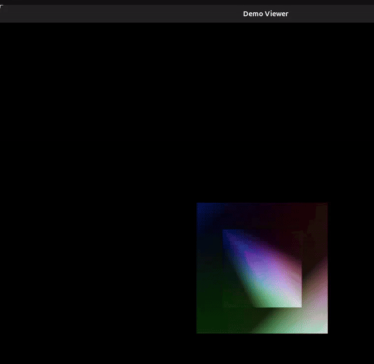

# Software 3D Renderer (Java)

A CPU-based 3D graphics pipeline implemented from scratch.

## Features

- Triangle rasterization
- Barycentric interpolation
- Z-buffer depth testing
- Per-pixel lighting
- Procedural icosphere mesh generation
- Matrix-based vertex rotation
- Perspective projection
- Swing-based interactive viewer
- Alternate sphere and wireframe paths present in code/comments

## Pipeline

`Vertex transformation`
→ `Triangle rasterization`
→ `Barycentric interpolation`
→ `Depth testing using Z-buffer`
→ `Pixel shading`

## Current Display

- Window title: `Demo Viewer`
- Bottom slider controls horizontal rotation
- Right slider controls vertical rotation
- Default app path currently displays a coloured tetrahedron
- Sphere-generation and wireframe-related paths are also present in the codebase and reflected in the captured recordings

## Codebase Details

- [`src/main/java/org/Aayush/Core/SliderUtil.java`](./src/main/java/org/Aayush/Core/SliderUtil.java): XZ and YZ rotation transforms using 3x3 matrices
- [`src/main/java/org/Aayush/Core/Matrix3.java`](./src/main/java/org/Aayush/Core/Matrix3.java): matrix multiplication and vertex transform support
- [`src/main/java/org/Aayush/Rasterization/Rasterizer.java`](./src/main/java/org/Aayush/Rasterization/Rasterizer.java): perspective projection, barycentric triangle fill, z-buffering, interpolated normals, and per-pixel lighting
- [`src/main/java/org/Aayush/Rasterization/Shader.java`](./src/main/java/org/Aayush/Rasterization/Shader.java): normalization, cross products, vertex-colour generation, and gamma-aware shade helper
- [`src/main/java/org/Aayush/Runner/MulticolourSphere.java`](./src/main/java/org/Aayush/Runner/MulticolourSphere.java): icosahedron creation plus repeated inflation toward an icosphere
- [`src/main/java/org/Aayush/Runner/Drawer.java`](./src/main/java/org/Aayush/Runner/Drawer.java): active tetrahedron scene, commented sphere render path, and commented wireframe path
- [`src/main/java/org/Aayush/Runner/DemoViewer.java`](./src/main/java/org/Aayush/Runner/DemoViewer.java): Swing viewer and interactive slider controls

## Screen Captures

All GIFs below were generated from the recordings in [`ScreenCpatures`](./ScreenCpatures).

### Capture 1



### Capture 2



### Capture 3


### Capture 4


### Capture 5


### Capture 6


### Capture 7



## Build And Run

### Requirements

- Java 8 or newer
- Maven

### Run

```bash
mvn compile
mvn exec:java -Dexec.mainClass=org.Aayush.App
```

### Test

```bash
mvn test
```
